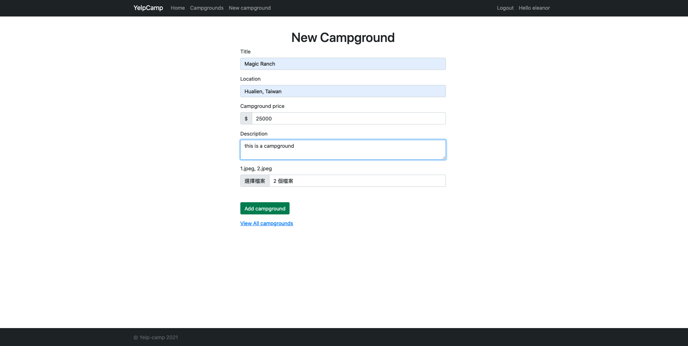

# Yelp Camp
## Overview
Yelp Camp is the final project from Colt Steele's [The Web Developer Bootcamp 2021](https://www.udemy.com/course/the-web-developer-bootcamp/)
A full stack web application mimicking Yelp which allows users to post campground experience and leave reviews.
#### To see the app in action: https://murmuring-shore-53218.herokuapp.com/

## Features
-  Landing page

- Index page incorporated with cluster map (using mapbox)

- Campground detail page to show campground and reviews

- Logged in users can post new campground

- Campground owner can update/delete the content

## Packages
- Use [MongoDB Atlas](https://www.mongodb.com/cloud/atlas/lp/try2?utm_source=google&utm_campaign=gs_apac_taiwan_search_core_brand_atlas_desktop&utm_term=mongodb%20atlas&utm_medium=cpc_paid_search&utm_ad=e&utm_ad_campaign_id=12212624371&gclid=CjwKCAjwqvyFBhB7EiwAER786Qvr7IRgIUXcVj8irL7IOHpjqHZbnlbHRlF7XMi84oZe8DeSvr_TWBoCnzMQAvD_BwE) as database 
- RWD with [Bootstrap v5](https://getbootstrap.com/)
- CRUD functionality with RESTFUL API
- Validate user input with [JOI](https://joi.dev/api/?v=17.4.0)
- Use [Cookie Parser](https://www.npmjs.com/package/cookie-parser), [Express-Session](https://www.npmjs.com/package/express-session), [Connect-Flash](https://github.com/jaredhanson/connect-flash) to store and send data
- User authentication & authorization with [Bcrypt](https://github.com/kelektiv/node.bcrypt.js) abd [PassportJS](http://www.passportjs.org/)
- Image upload with [Multer](https://github.com/expressjs/multer)
- Prevent Mongo injection using [Express Mongoose Sanitize](https://www.npmjs.com/package/express-mongo-sanitize)
- HTML sanitization with [sanitize-html](https://www.npmjs.com/package/sanitize-html)
- Protect HTTP headers with [Helmet](https://helmetjs.github.io/)

- Other services used in this project: [Mapbox](https://www.mapbox.com/) for map API, [Cloudinary](https://cloudinary.com/) to improve image load time, [Heroku](https://www.heroku.com) to deploy the App

## Future Improvement 

- Add search bar
- Add pagination 
- Add user profile page
